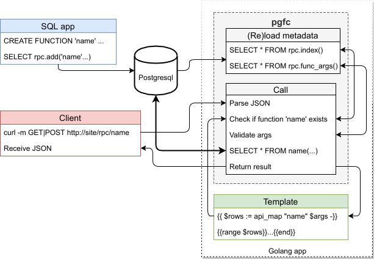

  English |
  <a href="docs/ru/README.md#pgcall">Pусский</a>

---

# pgcall
> golang package for postgresql functions calling

[![GoCard][gc1]][gc2]
 [![GitHub Release][gr1]][gr2]
 [![GitHub code size in bytes][sz]]()
 [![GitHub license][gl1]][gl2]

[gc1]: https://goreportcard.com/badge/apisite/pgcall
[gc2]: https://goreportcard.com/report/github.com/apisite/pgcall
[gr1]: https://img.shields.io/github/release/apisite/pgcall/all.svg
[gr2]: https://github.com/apisite/pgcall/releases
[sz]: https://img.shields.io/github/languages/code-size/apisite/pgcall.svg
[gl1]: https://img.shields.io/github/license/apisite/pgcall.svg
[gl2]: LICENSE

**Project status:** PoC is ready

## Notes

### Notes for "b2" prefix

It means "bridge to" and named in favour of [B-2](https://ru.wikipedia.org/wiki/%D0%91%D0%B8-2) group

## License

The MIT License (MIT), see [LICENSE](LICENSE).

Copyright (c) 2018 Aleksei Kovrizhkin <lekovr+apisite@gmail.com>
