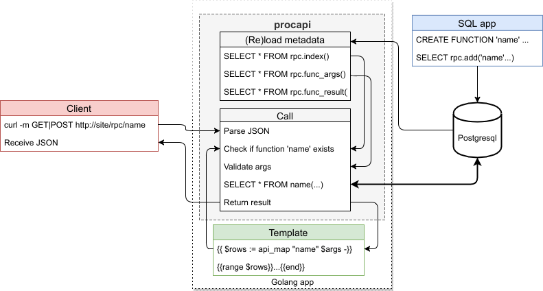

  English |
  <a href="README.ru.md#apisiteprocapi">Pусский</a>

---

# apisite/procapi
> Caller of postgresql stored functions, which intended to use via http and in templates

[![GoDoc][gd1]][gd2]
 [![codecov][cc1]][cc2]
 [![Build Status][bs1]][bs2]
 [![GoCard][gc1]][gc2]
 [![GitHub Release][gr1]][gr2]
 [![LoC][loc1]][loc2]
 [![GitHub code size in bytes][sz]]()
 [![GitHub license][gl1]][gl2]

[bs1]: https://cloud.drone.io/api/badges/apisite/procapi/status.svg
[bs2]: https://cloud.drone.io/apisite/procapi
[cc1]: https://codecov.io/gh/apisite/procapi/branch/master/graph/badge.svg
[cc2]: https://codecov.io/gh/apisite/procapi
[gd1]: https://godoc.org/github.com/apisite/procapi?status.svg
[gd2]: https://godoc.org/github.com/apisite/procapi
[gc1]: https://goreportcard.com/badge/github.com/apisite/tpl2x
[gc2]: https://goreportcard.com/report/github.com/apisite/procapi
[gr1]: https://img.shields.io/github/release-pre/apisite/procapi.svg
[gr2]: https://github.com/apisite/procapi/releases
[sz]: https://img.shields.io/github/languages/code-size/apisite/procapi.svg
[loc1]: .loc.svg "Lines of Code"
[loc2]: LOC.md
[gl1]: https://img.shields.io/github/license/apisite/procapi.svg
[gl2]: LICENSE

**Project status:** WIP

## License

The MIT License (MIT), see [LICENSE](LICENSE).

Copyright (c) 2018 Aleksei Kovrizhkin <lekovr+apisite@gmail.com>
